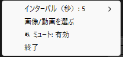

# FullScreenCover

Pythonで作成されたカスタムスクリーンセーバー。Windows環境でフルスクリーンモード実行中にスクリーンセーバーを表示できます。

## 特徴

- **無操作時間を簡単に変更できる機能**: +10秒/-10秒、または定型値（30秒、60秒、2分、5分、10分）
- **表示する画像を選べる機能**: 画像（PNG, JPG, JPEG, BMP）や動画（MP4, AVI, MOV）をスクリーンセーバーとして使用
- **複数ディスプレイ対応**: ディスプレイを選択してスクリーンセーバーを表示（プライマリ、全ディスプレイ、指定ディスプレイを選択）
- **ミュート設定切替**: スクリーンセーバー起動時に自動ミュートする機能のON/OFF
- **動画抑制設定切替**: 動画再生中のスクリーンセーバー抑制機能のON/OFF
- **タスクトレイ統合**: システムトレイから簡単に設定変更や終了が可能

## Installation

Release版のバイナリは [Releases](https://github.com/zukio/FullScreenCover/releases/) からダウンロードできます。

## 使用方法



### GUIモード：タスクトレイメニュー

システムトレイのアイコンから以下の操作が可能：

#### メディアファイル選択機能

- ドットバイドットで表示されます

##### 画像 対応ファイル形式

- PNG, JPG, JPEG, BMP

##### 動画 対応ファイル形式

- MP4, AVI, MOV
- 音声付き動画選択可（映像のみが再生され、音声は出力されません。）

#### ディスプレイ選択機能

複数ディスプレイ環境で、スクリーンセーバーを表示するディスプレイを選択できます：

##### 表示オプション

- **プライマリディスプレイ**: メインディスプレイのみに表示（デフォルト）
- **全ディスプレイ**: 接続されている全てのディスプレイに表示
- **指定ディスプレイ**: 特定のディスプレイを選択して表示

#### ミュート設定

スクリーンセーバー起動時に自動的に音声をミュートする機能のON/OFFを切り替えられます。

#### 動画プレイヤー検出

- **対応プレイヤー**: VLC, MPC-HC, MPC-BE, KMPlayer, PotPlayer, mpv, Windows Media Player, Windows 11 メディア プレーヤー等
- **条件**:
  - フルスクリーン表示時・映像再生中のみ抑制
  - 大きなウィンドウ（1200x800以上）でも抑制

##### ブラウザ動画再生

- **対応ブラウザ**: Chrome, Firefox, Edge, その他
- **対応サイト**: YouTube, Netflix, Amazon Prime, Twitch, Vimeo等
- **条件**: 動画サイトでフルスクリーン再生時

##### プレゼンテーション

- **対応アプリ**: Microsoft PowerPoint
- **条件**:
  - **第1優先**: PowerPoint COM APIによる動画オブジェクト検出（推奨）
    - スライドショーモード +メディアオブジェクトが**再生中**の場合に抑制
  - **フォールバック**: スライドショーモード + CPU使用率10%以上（従来方式）
    - COM APIが利用できない環境での代替手段

## 開発

### 前提条件

- Windows 10/11
- Python 3.8以上
- Git

### セットアップ手順

1. **リポジトリのクローン**

  ```bash
  git clone <repository-url>
  cd FullScreenCover
  ```

2. **仮想環境の作成と有効化**

  ```bash
  python -m venv venv
  venv\Scripts\activate
  ```

3. **依存関係のインストール**

  ```bash
  pip install -r requirements.txt
  ```

4. **pywin32の設定**

  ```bash
  python venv\Scripts\pywin32_postinstall.py -install
  ```

5. **アプリケーション実行**
  
  ```bash
  python main.py
  ```

### プロジェクト構造

```
FullScreenCover/
├── main.py                  # メインアプリケーション
├── screensaver.py           # スクリーンセーバー表示ロジック
├── tray_menu.py             # タスクトレイメニュー
├── config.json              # 設定ファイル
├── requirements.txt         # Python依存関係
├── assets/                  # アセットファイル
│   ├── icon.ico             # タスクトレイアイコン
│   └── image.png            # デフォルト画像
├── modules/                 # モジュール群
│   ├── audio_devices.py     # 音声制御
│   ├── lock.py              # 抑制機能・プロセス管理
│   ├── utils/               # ユーティリティ
│   └── communication/       # 通信関連
└── backup/                  # テストスクリプトなど
```

### 主要コンポーネント

#### ScreensaverController (`main.py`)

- アプリケーションのメインコントローラー
- 設定管理、モニタリングスレッド制御
- 音声制御との統合

#### TrayMenu (`tray_menu.py`)

- pystrayを使用したシステムトレイ統合
- 動的メニュー生成、設定変更インターフェース

#### VolumeController (`modules/audio_devices.py`)

- pycawを使用したWindows音量制御
- 状態保存・復元機能

#### WindowDetection (`modules/lock.py`)

- win32apiを使用したウィンドウ情報取得
- フルスクリーン判定、プロセス監視

#### config.json

設定は `config.json` ファイルで管理されます：

```json
{
 "interval": 5,
 "media_file": "assets/background.jpg",
 "mute_on_screensaver": true,
 "suppress_during_video": false,
 "enable_presentation_mode": true,
 "presentation_features": {
  "disable_screensaver": true,
  "prevent_sleep": true,
  "silent_notifications": true,
  "block_notifications": true
 },
 "suppress_large_window": false,
 "display_mode": "specific",
 "display_index": 0
}
```

### トラブルシューティング

#### pywin32関連エラー

```bash
# DLL登録を実行
python venv\Scripts\pywin32_postinstall.py -install
```

#### pycaw/音量制御エラー

```bash
# pycawの再インストール
pip uninstall pycaw -y
pip install pycaw
```

#### タスクトレイアイコンが表示されない

- `assets/icon.ico` ファイルが存在することを確認
- 管理者権限で実行してみる

#### スクリーンセーバーが表示されない

- メディアファイルのパスが正しいことを確認
- ファイル形式が対応しているか確認
- `test_screensaver_display.py` でテスト実行

### ログとデバッグ

アプリケーションは詳細なログを出力します：

#### ログ出力先

- **コンソール**: INFO レベル以上のログをリアルタイムで表示
- **ログファイル**: `logs/YYYY-MM-DD.log` にすべてのログレベルを記録

> **注意**: アプリケーションを `C:\Program Files` などの権限が必要な場所に配置した場合、自動的にユーザーディレクトリ `C:\Users\[ユーザー名]\FullScreenCover\logs\` にログが保存されます。

#### ログ内容

- アプリケーションの起動・終了
- 多重起動制御の状態
- ディスプレイ検出情報
- 現在のウィンドウ情報
- アイドル時間、抑制状態（DEBUG レベル）
- 音量制御の状態変化
- スクリーンセーバーの開始・終了
- エラーや警告メッセージ

#### ログレベル

- **DEBUG**: 詳細なデバッグ情報（ファイルのみ）
- **INFO**: 一般的な動作情報
- **WARNING**: 警告メッセージ  
- **ERROR**: エラーメッセージ
- **CRITICAL**: 致命的エラー
