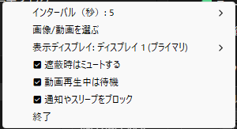

# FullScreenCover

Pythonで作成されたカスタムスクリーンセーバー。Windows環境でフルスクリーンモード実行中にスクリーンセーバーを表示できます。

## 特徴

- **表示する画像を選べる機能**: 画像（PNG, JPG, JPEG, BMP）や動画（MP4, AVI, MOV）をスクリーンセーバーとして使用
- **無操作時間を簡単に変更できる機能**: 1秒から任意の秒数まで無操作時間を設定可能
- **複数ディスプレイ対応**: ディスプレイを選択してスクリーンセーバーを表示（プライマリ、全ディスプレイ、指定ディスプレイ）
- **自動音声ミュート**: スクリーンセーバー動作中の自動ミュート機能（オプション）
- **動画再生中の抑制機能**: 動画再生中やプレゼン中の自動抑制
- **複数ディスプレイ対応**: 特定のディスプレイを選択してスクリーンセーバーを表示

## 動画再生中の抑制機能

以下の状況では自動的にスクリーンセーバーを抑制します：

### 動画プレイヤー検出

- **対応プレイヤー**: VLC, MPC-HC, MPC-BE, KMPlayer, PotPlayer, mpv, Windows Media Player, Windows 11 メディア プレーヤー等
- **条件**:
  - フルスクリーン表示時は必ず抑制
  - 大きなウィンドウ（1200x800以上）でも抑制

### ブラウザ動画再生

- **対応ブラウザ**: Chrome, Firefox, Edge, その他
- **対応サイト**: YouTube, Netflix, Amazon Prime, Twitch, Vimeo等
- **条件**: 動画サイトでフルスクリーン再生時

### プレゼンテーション

- **対応アプリ**: Microsoft PowerPoint
- **条件**:
  - **第1優先**: PowerPoint COM APIによる動画オブジェクト検出（推奨）
    - スライドショーモードでメディアオブジェクトが存在する場合に抑制
    - 動画の再生状態を直接確認、環境依存性なし
  - **フォールバック**: スライドショーモード + CPU使用率10%以上（従来方式）
    - COM APIが利用できない環境での代替手段

## Installation

Release版のバイナリは [Releases](https://github.com/zukio/FullScreenCover/releases/) からダウンロードできます。

## 使用方法



### GUIモード：タスクトレイメニュー

システムトレイのアイコンから以下の操作が可能：

- **インターバル調整**: +10秒/-10秒、または定型値（30秒、60秒、2分、5分、10分）
- **メディアファイル選択**: ファイルダイアログからメディアファイルを選択
- **表示ディスプレイ選択**: プライマリディスプレイ、全ディスプレイ、または指定ディスプレイを選択
- **ミュート設定切替**: スクリーンセーバー起動時に自動ミュートする機能のON/OFF
- **動画抑制設定切替**: 動画再生中のスクリーンセーバー抑制機能のON/OFF
- **アプリケーション終了**: 安全な終了処理

### ディスプレイ選択機能

複数ディスプレイ環境で、スクリーンセーバーを表示するディスプレイを選択できます：

#### 表示オプション

- **プライマリディスプレイ**: メインディスプレイのみに表示（デフォルト）
- **全ディスプレイ**: 接続されている全てのディスプレイに表示
- **指定ディスプレイ**: 特定のディスプレイを選択して表示

#### ディスプレイ情報

- 各ディスプレイの解像度と位置が自動検出されます
- プライマリディスプレイが明確に表示されます
- 例：「ディスプレイ 1 (プライマリ) - 1920x1080」「ディスプレイ 2 - 2560x1440」

詳細については [DISPLAY_FEATURES.md](DISPLAY_FEATURES.md) をご覧ください。

### 対応ファイル形式

#### 画像

- PNG, JPG, JPEG, BMP
- フルスクリーン表示
- ドットバイドットで表示されます

#### 動画

- MP4, AVI, MOV
- 音声付き動画対応

##### 動画再生中の抑制機能

以下の状況では自動的にスクリーンセーバーを抑制します：

- **動画プレイヤー検出**
  - **対応プレイヤー**: VLC, MPC-HC, MPC-BE, KMPlayer, PotPlayer, Windows Media Player, Movies & TV
  - **条件**: フルスクリーン表示時のみ抑制

- **ブラウザ動画再生**

  - **対応ブラウザ**: Chrome, Firefox, Edge, その他
  - **条件**: YouTubeなどの動画サイトでフルスクリーン再生時

- **プレゼンテーション**

  - **対応アプリ**: Microsoft PowerPoint
  - **条件**: スライドショーモード + CPU使用率10%以上（動画スライド再生中）

## 開発

### 前提条件

- Windows 10/11
- Python 3.8以上
- Git

### セットアップ手順

1. **リポジトリのクローン**

  ```bash
  git clone <repository-url>
  cd FullScreenCover
  ```

2. **仮想環境の作成と有効化**

  ```bash
  python -m venv venv
  venv\Scripts\activate
  ```

3. **依存関係のインストール**

  ```bash
  pip install -r requirements.txt
  ```

4. **pywin32の設定**

  ```bash
  python venv\Scripts\pywin32_postinstall.py -install
  ```

5. **アプリケーション実行**
  
  ```bash
  python main.py
  ```

### プロジェクト構造

```
FullScreenCover/
├── main.py                    # メインアプリケーション
├── screensaver.py            # スクリーンセーバー表示ロジック
├── tray_menu.py              # タスクトレイメニュー
├── config.json               # 設定ファイル
├── requirements.txt          # Python依存関係
├── assets/                   # アセットファイル
│   ├── icon.ico             # タスクトレイアイコン
│   └── image.png            # デフォルト画像
├── modules/                  # モジュール群
│   ├── audio_devices.py     # 音声制御
│   ├── lock.py              # 抑制機能・プロセス管理
│   ├── utils/               # ユーティリティ
│   └── communication/       # 通信関連
└── tests/                   # テストスクリプト
```

### 主要コンポーネント

#### ScreensaverController (`main.py`)

- アプリケーションのメインコントローラー
- 設定管理、モニタリングスレッド制御
- 音声制御との統合

#### TrayMenu (`tray_menu.py`)

- pystrayを使用したシステムトレイ統合
- 動的メニュー生成、設定変更インターフェース

#### VolumeController (`modules/audio_devices.py`)

- pycawを使用したWindows音量制御
- 状態保存・復元機能

#### WindowDetection (`modules/lock.py`)

- win32apiを使用したウィンドウ情報取得
- フルスクリーン判定、プロセス監視

#### config.json

設定は `config.json` ファイルで管理されます：

```json
{
  "interval": 300,
  "media_file": "path/to/your/image_or_video.png",
  "mute_on_screensaver": true,
  "suppress_during_video": true
}
```

### テスト

各機能のテストスクリプトが用意されています：

```bash
# 機能全体のテスト
python test_features.py

# 音量制御のテスト
python test_volume.py

# スクリーンセーバー表示のテスト
python test_screensaver_display.py
```

## トラブルシューティング

### よくある問題

#### pywin32関連エラー

```bash
# DLL登録を実行
python venv\Scripts\pywin32_postinstall.py -install
```

#### pycaw/音量制御エラー

```bash
# pycawの再インストール
pip uninstall pycaw -y
pip install pycaw
```

#### タスクトレイアイコンが表示されない

- `assets/icon.ico` ファイルが存在することを確認
- 管理者権限で実行してみる

#### スクリーンセーバーが表示されない

- メディアファイルのパスが正しいことを確認
- ファイル形式が対応しているか確認
- `test_screensaver_display.py` でテスト実行

### ログとデバッグ

アプリケーションは詳細なログを出力します：

- 現在のウィンドウ情報
- アイドル時間、抑制状態
- 音量制御の状態変化
- スクリーンセーバーの開始・終了
